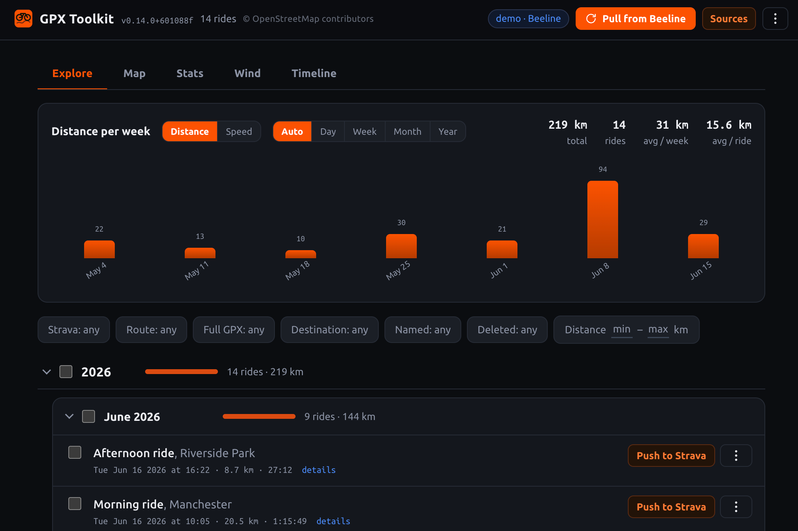
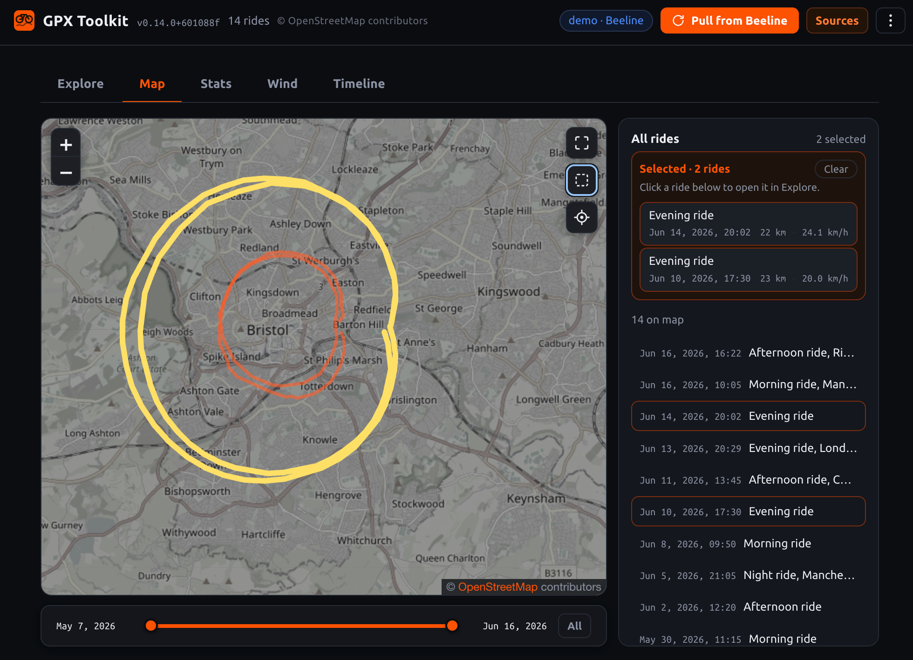
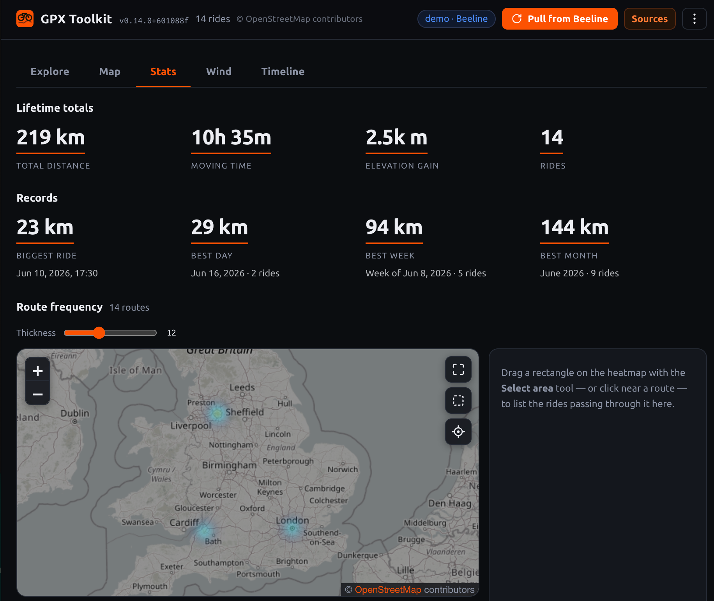
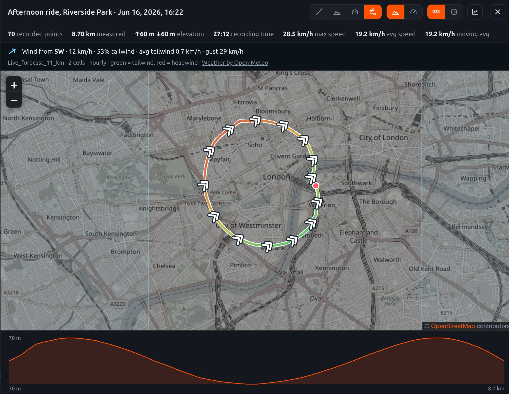

# GPX Toolkit

A **backend-free** browser app to explore, map, analyze and export your bike rides. Bring
your rides in as plain **GPX files** — no account, no sign-up, nothing to install — and the
app gives you an interactive library: a distance/speed chart with KPIs, year/month grouping,
per-ride maps and elevation, a route-frequency heatmap, rich filters, and re-export. That's
the whole app, and it works entirely on its own.

On top of that, it has a first-class **Beeline Velo 2** integration: connect your Beeline
account and it pulls your **entire** ride history in one shot and batch-uploads rides to
**Strava** server-side. Beeline is a *great optional source*, not a requirement — every
feature except the Beeline-specific ones (history pull, Strava upload) works with GPX files
alone.

Rides from every source **coexist in one unified library** — each tagged by its source, with
a source filter — and source-dependent actions are gated per ride (e.g. *Push to Strava*
shows only on Beeline rides). Two sources today:

- **GPX files** *(no account needed)* — drag-and-drop `.gpx` files (or a `.zip` bundle)
  recorded by any device or app. They're parsed **locally**, metrics derived from the
  recorded track, and stored in your browser. Explore, map, analyze and re-export them — the
  app is fully functional with just this source.
- **Beeline account** *(optional)* — sign in with your Beeline email/password and the app
  downloads your **entire** ride history (routes, stats, Strava status) in a single request
  from Beeline's own cloud backend, then uploads to Strava server-side (fast, several rides
  at once). Beeline only lets you upload one-by-one; this lists your rides with their upload
  status, lets you select them, and uploads in a batch. Works in any modern browser.

There's also a **demo** so you can explore the Beeline experience with no account and no data
of your own.

> **Your Beeline password is never stored.** Sign-in uses it once to obtain a short-lived
> token held only in memory; nothing is written to disk. On reload (or whenever an action
> needs the account) the app shows your last-downloaded rides and asks you to sign in again
> — so your **browser/password manager** can inject the password on demand. See
> [Beeline account & your password](#beeline-account--your-password).

> **Vibe coded.** This project is almost entirely "vibe coded" — developed with the help of
> LLM coding agents. Review accordingly and expect the occasional rough edge.

Everything runs **in the browser**: GPX files are parsed locally, and the optional
Beeline-account source talks to Beeline's Firebase backend over `fetch` (CORS-friendly, no
proxy). There is no server and no rooting. State is kept in the browser (IndexedDB), with all
sources' rides in one unified store.

<table>
  <tr>
    <td></td>
    <td></td>
  </tr>
  <tr>
    <td></td>
    <td></td>
  </tr>
</table>

## Requirements

- Any modern browser; the page served over `localhost` or HTTPS. **That's it** to use the
  app with your own GPX files.
- *Only for the optional Beeline source:* a **Beeline account**, with **Strava already
  connected** if you want to upload (in the Beeline app: Settings → Integrations → Strava).
- For development: Node.js 20+ and npm.

## Quick start

```bash
npm install
npm run dev          # open the printed http://localhost:… URL
```

The app boots straight into your (initially empty) **ride library**. On the very first launch
a short **Sources** dialog explains the model and lets you fill it: **Add GPX files** to start
with no account, or **connect Beeline** (or try its **demo**). You can open **Sources** from
the header any time to connect or manage sources — there's no per-source "mode" to switch.

## Beeline account & your password

The design goal is to **never store your Beeline password in clear** (or at all):

- Signing in sends the password **once** to Beeline's auth endpoint and keeps only the
  resulting short-lived ID token **in memory**. The password is never persisted, and the
  token is gone on reload.
- Only your **email** and the fact that you last used the Beeline source are remembered, to
  prefill and re-open the sign-in.
- On reload, the app enters an **offline, cached-rides** mode (everything you already
  downloaded is fully browsable). The moment you do something that needs the account —
  **Pull from Beeline** or **Push to Strava** — it asks you to sign in again, which is exactly
  when your **password manager** can autofill it. The action you triggered then runs.

This keeps the app autonomous offline and leaves password custody entirely to your browser /
password manager.

## Full-track GPX & the optional export gateway

Saving a ride's **full** recorded GPX (real per-point timestamps + elevation) needs one
server-side hop: Beeline renders the file to Firebase Storage, and the authenticated
download there 302-redirects to a Google host that returns **no CORS header**, so a browser
can't complete it. The app ships an **optional**, stateless relay for this
([`infra/gpx-relay`](infra/gpx-relay/README.md) — a zero-dependency AWS Lambda you host).

- It's **off by default**: with no relay configured the app is fully backend-free, and the
  light **route-only** GPX (synthesized from the cached polyline) still works everywhere.
- When a relay **is** configured (build-time `GPX_RELAY_URL`), the first full-GPX download
  shows a **one-time consent** prompt explaining that the request is routed through your
  gateway. It forwards only your **short-lived sign-in token and the ride id** — never your
  password — and the gateway **stores nothing**. Tick *"Don't ask again"* to remember it.
- If the gateway is ever **unreachable**, the download **degrades gracefully** to a
  route-only GPX instead of failing.

See [`infra/gpx-relay/README.md`](infra/gpx-relay/README.md) for the AWS deploy guide and the
(free, fail-closed) rate-limiting / cost-safety model.

## Usage

- **Fill your library** — **Add GPX files** (drag-and-drop or pick `.gpx`/`.zip`), and/or
  open **Sources** to connect Beeline and **Pull from Beeline** to download your whole
  history in one shot.
- See a **distance/speed chart** with quick KPIs (total km, ride count, averages), bucketed
  by day / week / month / year.
- Rides are grouped by **year → month**, each header showing a riding-volume bar (its
  distance vs the busiest sibling) and a **select-all checkbox** for batch actions.
- Expand any ride to see full details (distance, avg/max speed, moving / elapsed time,
  elevation) and its GPS route on a map.
- **Map** view plots every ride's track as an overlapping heatmap; a **Stats** view adds a
  route-frequency heatmap and lifetime totals/records. Both have a *locate me* toggle and a
  rubber-band area filter.
- **Filter** by source, route presence, distance, whether you've named the ride — plus, for
  Beeline rides, **Strava status** (Pending / Uploaded / Other) and destination.
- **Push to Strava** *(Beeline rides only)* — upload one ride, the current selection, or
  *all* pending, with a live progress indicator. Uploads run **concurrently**, server-side.
  A bulk action over a mixed selection acts on the upload-capable subset and reports the rest
  as skipped.
- **Download GPX** for any ride (synthesized from the stored track — works offline too).
- **Queue work freely** — requests line up and drain in order, coalescing consecutive
  sweeps. Use **Stop** to manage it. Local data can be exported/imported as JSON, and the
  re-fetchable download cache flushed, from the **Data** menu.

## Scripts

```bash
npm run dev          # Vite dev server
npm run build        # type-check (tsc --noEmit) + production build to dist/
npm run preview      # serve the production build
npm test             # run the vitest suite
npm run test:watch   # watch mode
```

## Project layout

| Path | Responsibility |
|------|----------------|
| [index.html](index.html) | App shell, styles, markup, and the Sources dialog |
| [src/main.ts](src/main.ts) | UI entry point — rendering, DOM wiring, Sources dialog, GPX import |
| [src/controller.ts](src/controller.ts) | App state + source registry + per-ride dispatch |
| [src/source.ts](src/source.ts) | `RideSource` seam + capabilities + shared GPX/catalog types |
| [src/gpx-source.ts](src/gpx-source.ts) | `GpxRideSource` — import `.gpx`/`.zip`, local metrics/export |
| [src/beeline-api.ts](src/beeline-api.ts) | Beeline cloud backend client (auth, rides, upload) |
| [src/beeline-source.ts](src/beeline-source.ts) | `BeelineRideSource` — the account source over the API |
| [src/beeline-demo.ts](src/beeline-demo.ts) | Simulated Beeline backend for the account demo |
| [src/parsing.ts](src/parsing.ts) | Normalized metrics + ride-key/date + uid helpers |
| [src/jobs.ts](src/jobs.ts) | Single-worker background job queue |
| [src/store.ts](src/store.ts) | Unified, versioned IndexedDB ride store |
| [src/track.ts](src/track.ts) | Decode/render ride GPS tracks |

## Tests

```bash
npm test
```

The Beeline-account source is tested against a captured backend response in
[tests/fixtures/beeline/](tests/fixtures/beeline/).

## Notes

- Your **Beeline password is never stored** — see
  [Beeline account & your password](#beeline-account--your-password).
- Only the Strava upload path is automated (komoot is detected but left alone).
