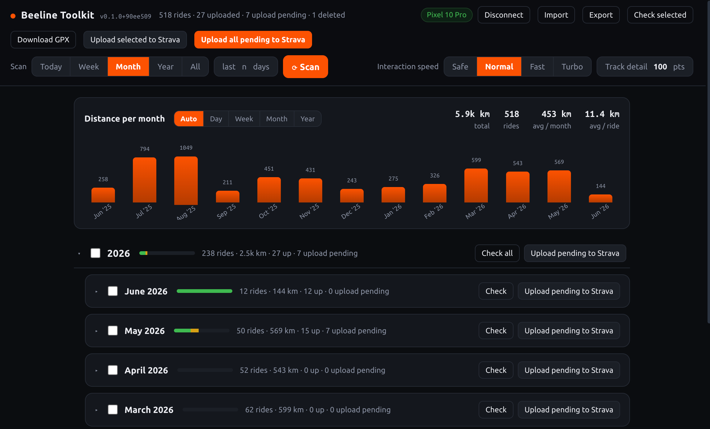

# Beeline Toolkit

A **backend-free** browser companion for the **Beeline Velo 2** that batch-uploads your
rides to **Strava**. Beeline only lets you upload rides one-by-one; this app lists your
rides with their upload status, lets you select them, and uploads in a batch.

> **Android only.** This drives the Beeline app over **ADB (Android Debug Bridge)**, which
> exists only on Android — there is **no iOS/iPhone support**, and none is possible.

Everything runs **in the browser**: it talks to a USB-connected Android phone directly over
**WebUSB** (ADB via [`@yume-chan/adb`](https://github.com/yume-chan/ya-webadb)) and drives
the **real Beeline app** (reads the screen, taps the buttons) — no server, no rooting, no
API reverse-engineering. State is kept in `LocalStorage`.



## Requirements

- An **Android** phone — iOS/iPhone is **not supported** (the tool relies on ADB, which is
  Android-only).
- A Chromium-based browser (Chrome / Edge) — WebUSB is required and is not available in
  Firefox/Safari.
- The page must be served over `localhost` or HTTPS (WebUSB is secure-context only).
- A phone with the Beeline Velo 2 app (`co.beeline`) and **Strava already connected**
  (Settings → Integrations → Strava).
- USB debugging enabled (Developer Options), phone plugged in and **authorized**.
- Node.js 20+ and npm to run the dev server / build.

## Quick start

```bash
npm install
npm run dev          # open the printed http://localhost:… URL in Chrome
```

The app boots in **demo mode** with sample rides so you can explore the UI without a phone.
Click **Connect phone** to grant WebUSB access to your device and switch to live mode; the
browser remembers the permission so it silently reconnects on later visits.

## Usage

- **Scan a time range** — choose Today / Week / Month / Year / All, or a custom number of
  days, then press **Scan**. Scans stop early once they pass the chosen window, so
  "Today" or "Week" return quickly instead of walking your whole history.
- See a **distance-per-month chart** with quick KPIs (total km, ride count, averages) for
  whatever you've scanned.
- Rides are grouped by **year → month** with a green/amber bar showing uploaded vs pending.
  Each year and month has a **select-all checkbox** (indeterminate when partially selected)
  plus **Check** / **Upload pending** buttons, so you can batch a whole month or year.
- Expand any ride to see full details (distance, avg/max speed, moving / elapsed time,
  elevation) and its route on a map.
- **Check status** of one ride, a whole month, or selected rides.
- **Upload** one ride, all pending in a month, selected rides, or *all* known pending —
  with a live progress indicator while it drives the phone.
- **Queue work freely** — click Upload or Check on as many rides/months/selections as you
  like; requests line up and the single phone worker drains them in order, coalescing
  consecutive sweeps. Use **Clear queue** (drop pending) and **Stop** (cancel the running
  task) to manage it.

### Interaction speed

The dominant cost per ride is reading the screen, so an **Interaction speed** control tunes
how aggressively the tool drives the phone — from extra settle time (most robust) up to
**Turbo**, which skips upload-verification reads (tap-and-go); a later **Check** reconciles
the real status.

## Scripts

```bash
npm run dev          # Vite dev server
npm run build        # type-check (tsc --noEmit) + production build to dist/
npm run preview      # serve the production build
npm test             # run the vitest suite
npm run test:watch   # watch mode
```

## Project layout

| Path | Responsibility |
|------|----------------|
| [index.html](index.html) | App shell, styles, and markup |
| [src/main.ts](src/main.ts) | UI entry point — rendering and DOM wiring |
| [src/controller.ts](src/controller.ts) | App state + scan/check/upload orchestration |
| [src/beeline.ts](src/beeline.ts) | Beeline app navigation + upload automation |
| [src/parsing.ts](src/parsing.ts) | Parse uiautomator dumps into ride data |
| [src/jobs.ts](src/jobs.ts) | Single-worker background job queue |
| [src/store.ts](src/store.ts) | LocalStorage-backed status cache |
| [src/track.ts](src/track.ts) | Decode/render ride GPS tracks |
| [src/adb/](src/adb/) | ADB transports — `webusb.ts` (real), `demo.ts` (sample data) |

## Tests

```bash
npm test
```

Parser tests run against real Beeline UI dumps captured during recon, stored in
[tests/fixtures/recon/](tests/fixtures/recon/).

## Notes

- UI automation is inherently slower than an API (~10 s per ride) and can break if Beeline
  changes its layout — update the coordinates/labels in [src/beeline.ts](src/beeline.ts)
  and [src/parsing.ts](src/parsing.ts) if that happens.
- Keep the phone unlocked and on while running; don't touch it mid-run.
- Only the Strava upload path is automated (komoot is detected but left alone).
