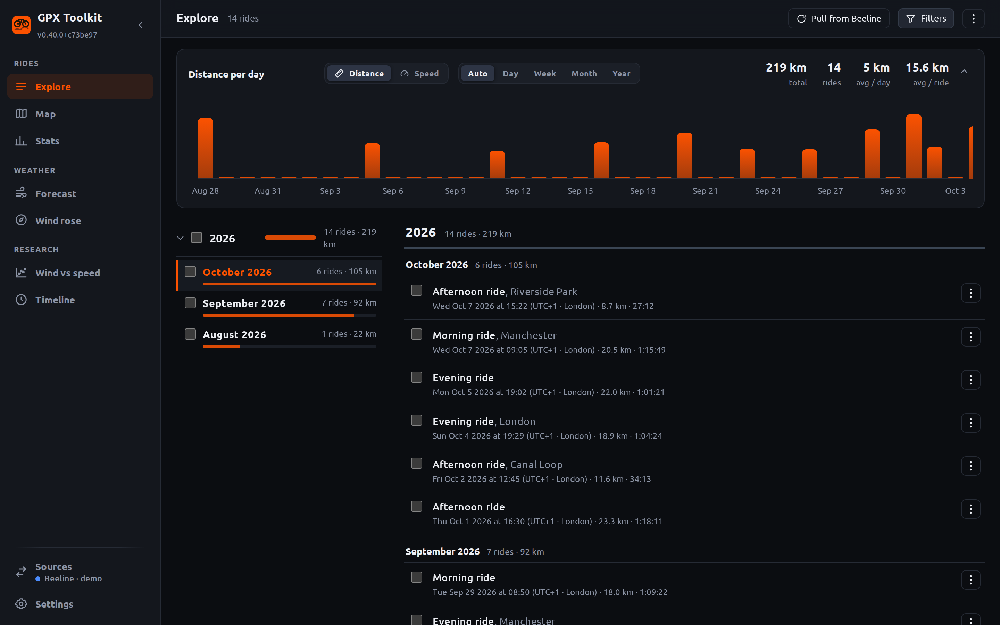
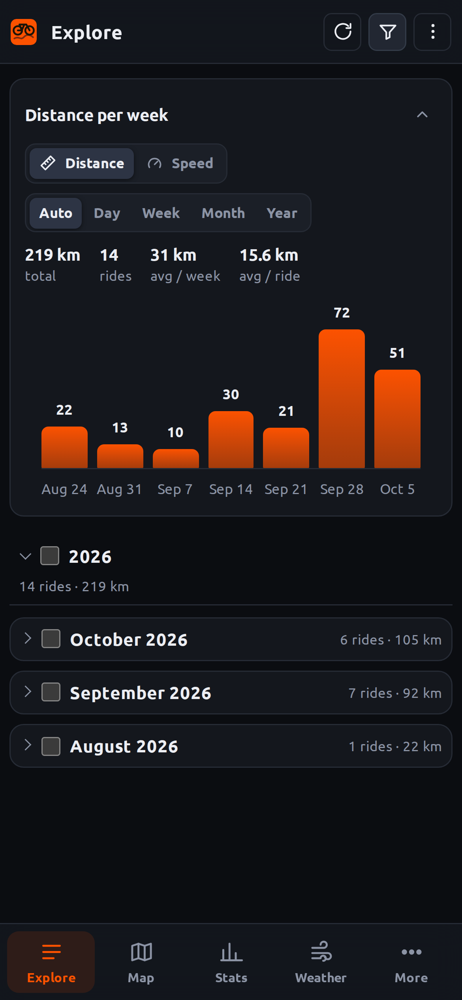
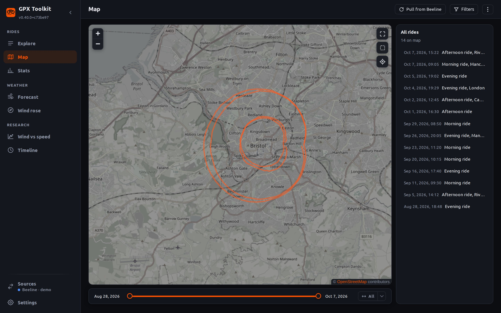
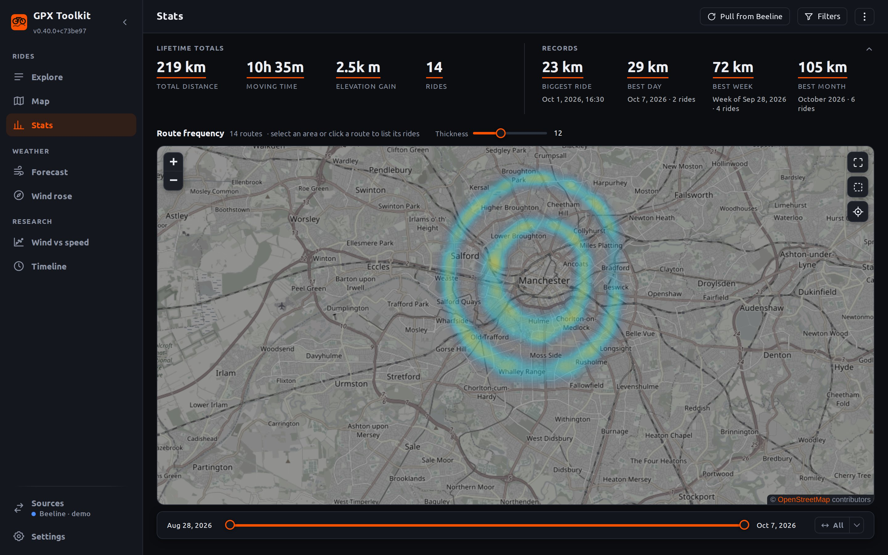
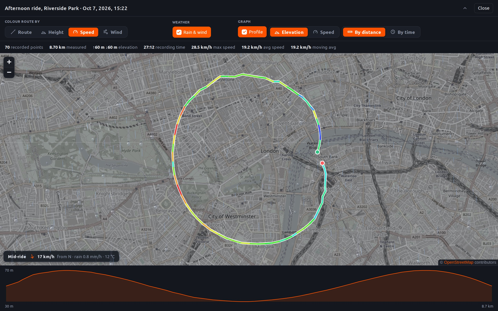
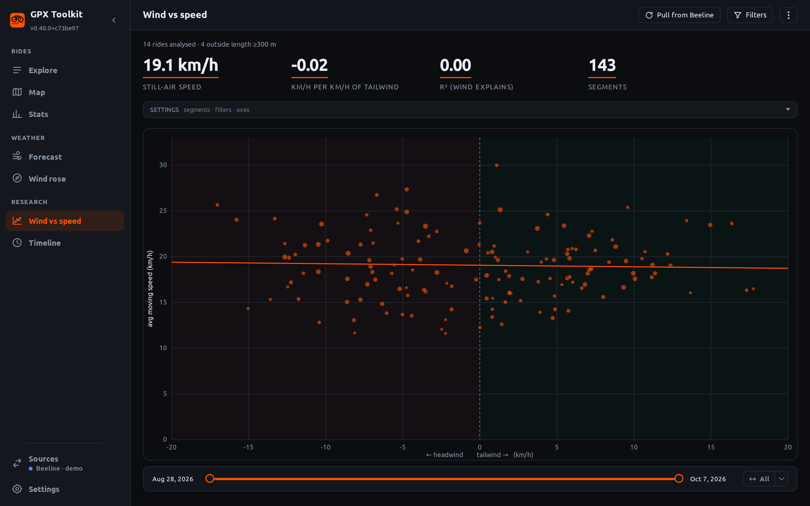
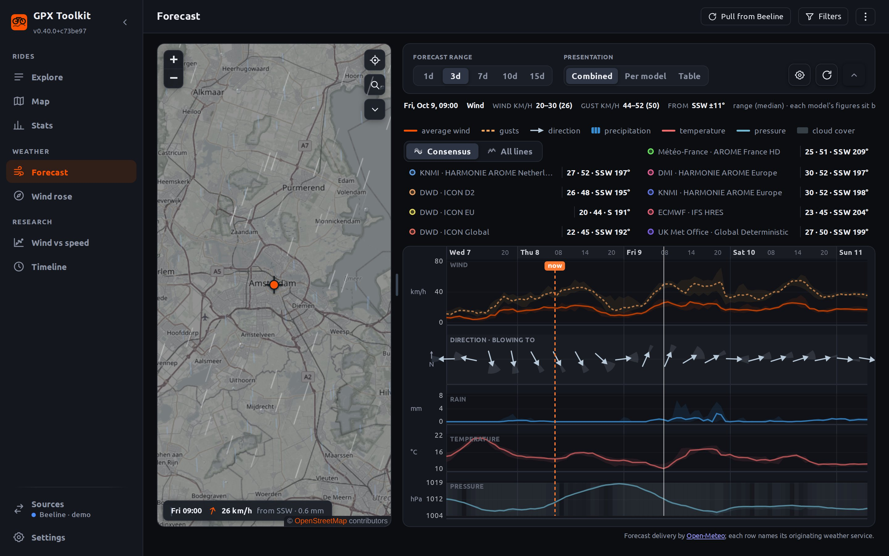
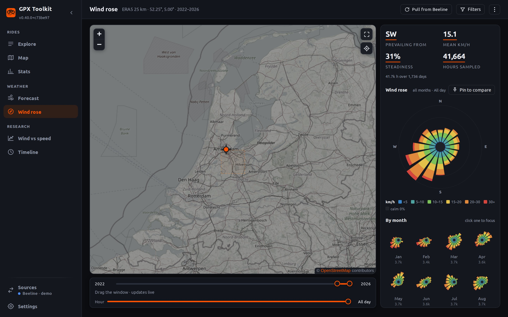

<p align="center">
  
</p>

<h1 align="center">GPX Toolkit</h1>

<p align="center">
  Explore, map and analyze your bike rides, right in the browser.<br>
  No sign-up, no server, nothing to install.
</p>

<p align="center">
  <a href="https://gubenkoved.github.io/gpx-toolkit/"><b>Open the app</b></a> ·
  <a href="#run-it-locally">Run it locally</a> ·
  <a href="#privacy">Privacy</a>
</p>

<p align="center">
  
  
</p>

## What it does

**Explore** (above) – every ride in one library, with a distance/speed chart, year → month
groups, filters, tags, batch actions and GPX download.

<table>
  <tr>
    <td width="50%" valign="top">
      <br>
      <b>Map</b> – every track on one map. Drag out an area to list the rides that passed
      through it.
    </td>
    <td width="50%" valign="top">
      <br>
      <b>Stats</b> – lifetime totals, records, and a heatmap of the routes you ride most.
    </td>
  </tr>
  <tr>
    <td width="50%" valign="top">
      <br>
      <b>Ride view</b> – a full-screen map coloured by height, speed or head/tailwind, with
      elevation and speed profiles and the rain and wind you rode in.
    </td>
    <td width="50%" valign="top">
      <br>
      <b>Wind vs speed</b> – how much the wind slows you down, measured on the straight
      stretches of your own rides.
    </td>
  </tr>
  <tr>
    <td width="50%" valign="top">
      <br>
      <b>Forecast</b> – hourly wind and weather for any spot from the 5–10 models that suit it
      best (HARMONIE over the Netherlands, HRRR over the US, ECMWF, ICON…), as charts or a
      timetable. The URL shares the spot.
    </td>
    <td width="50%" valign="top">
      <br>
      <b>Wind rose</b> – decades of ERA5 wind history for any point, by hour and month, with
      pin-to-compare across places or periods.
    </td>
  </tr>
</table>

**Routes** – plan routes on the map (they follow the bike paths) or import GPX files, then
pick a departure: the route is ridden through the forecast with your own wind-vs-speed
profile, so you see the ride time, arrival, headwind and rain for any start time, and
which hour of the day is fastest.

**Timeline** – import your Google Maps Timeline to see where you spend time, find when you
were somewhere, and replay a day.

Dark and light themes; on a phone the sidebar becomes a bottom navigation bar.

## Get your rides in

- **GPX files** – drop `.gpx` files (or a `.zip`) from any device or app. No account needed.
- **Beeline Velo** – sign in to pull your whole ride history at once and batch-upload rides
  to **Strava**. Connect Strava in the Beeline app first (Settings → Integrations → Strava).
- **Demo** – no rides yet? Click **Try the demo** in the empty library.

Rides from every source live in one library. Back it up or move it to another browser from
the **⋯** menu (Export / Import).

## Privacy

- **Your rides stay on your device**, in the browser's storage. There is no app server.
- **Your Beeline password is never stored.** It is exchanged once for a short-lived token
  kept in memory. After a reload the app asks again only when an action needs the account,
  so your password manager can fill it in.
- **Outside services:** Beeline (only if you connect it), map tiles from OpenStreetMap,
  weather and place search from Open-Meteo, bike routing from [BRouter](https://brouter.de/)
  (the waypoints of a route you plan), fonts from Google Fonts, and cookieless
  [GoatCounter](https://www.goatcounter.com/) visit counts (view names only, never ride
  data or locations).

## Run it locally

Needs Node.js 20+.

```bash
npm install
npm run dev
```

| Command | What it does |
|---------|--------------|
| `npm run dev` | Dev server |
| `npm run build` | Type-check and build to `dist/` |
| `npm test` | Run the tests (Vitest) |
| `npm run verify` | Type-check, lint and test (what CI runs) |

To self-host, serve `dist/` from any static host over HTTPS. Pushes to `main` deploy to
GitHub Pages.

**Full-track GPX for Beeline rides (optional).** A browser can't download Beeline's full
recorded GPX on its own (the final redirect has no CORS header), so downloads fall back to a
route-only GPX. To get timestamps and elevation, host the small relay in
[`infra/gpx-relay`](infra/gpx-relay/README.md) and build with `GPX_RELAY_URL` set.

## Project docs

- [Architecture](docs/architecture.md): how the app is put together and where things live.
- [`CHANGELOG.md`](CHANGELOG.md): why each change was made.
- [`docs/capture.mjs`](docs/capture.mjs): regenerates the screenshots above from the demo.

> **Vibe coded.** Almost all of this was written with LLM coding agents. Review
> accordingly and expect the occasional rough edge.
