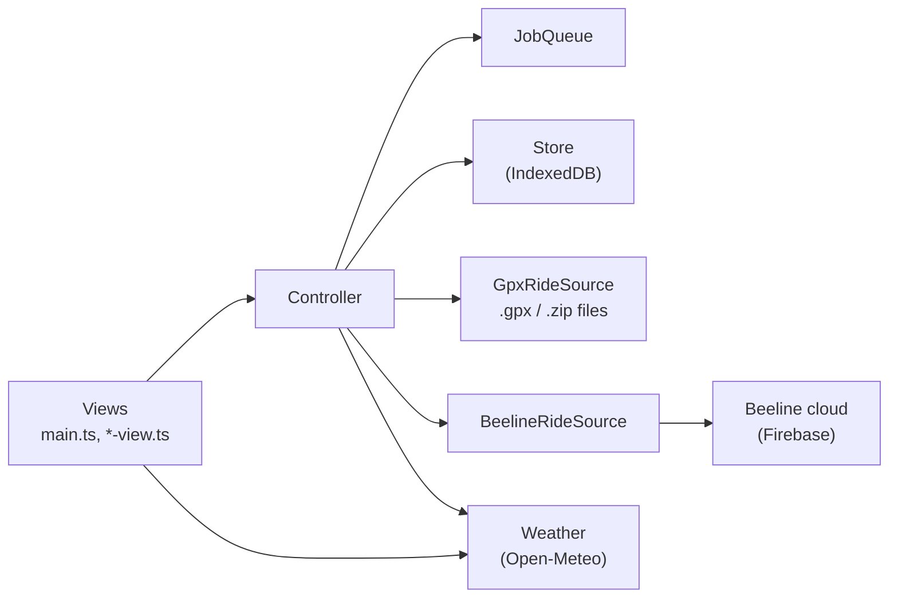

# Architecture

GPX Toolkit is a static single-page app: vanilla TypeScript and the DOM, no framework and
no backend. Vite builds it into `dist/`, which any static host can serve. Everything,
including parsing, statistics and storage, runs in the browser.

## The big picture

- **Views** render the UI and turn clicks into Controller calls. `main.ts` wires the app
  together; each larger screen has its own module (`map-view.ts`, `stats-view.ts`,
  `forecast-view.ts`, …).
- **Controller** (`controller.ts`) owns app state. It never talks to a backend directly:
  it keeps a registry of ride sources and sends each ride's action to the source that
  ride came from.
- **Ride sources** sit behind one interface, `RideSource` (`source.ts`), with flags for
  what each can do (`upload`, `import`). `GpxRideSource` imports local files and derives
  metrics from the track; `BeelineRideSource` pulls the whole history from Beeline's
  cloud in one request and uploads to Strava server-side. The demo (`beeline-demo.ts`)
  is a simulated Beeline backend.
- **JobQueue** (`jobs.ts`) runs long work (pulls, uploads, GPX downloads, wind lookups)
  one task at a time in the background, merging back-to-back uploads or downloads into
  one sweep.

## Rides

- **One library.** Rides from every source live in a single store, each tagged with its
  source. There is no per-source mode; UI that only applies to some rides (Strava upload,
  for example) is shown based on those rides' capabilities.
- **Identity.** A ride's id is `<source>::<identity>`. For Beeline the identity is the
  ride's start time; for GPX it is a SHA-256 hash of the file, so re-importing the same
  file is a no-op and two files that start in the same minute stay separate.
- **Dates.** Sorting, grouping and date filters always use the ride's date (its start
  time when the source has one), never the id.
- **Metrics** are converted to app units (km, seconds, km/h, metres) once, where a ride
  enters the app. A value the source didn't report stays `null`, never `0`.

## Storage

All data lives in the browser's IndexedDB:

| What | Module | Notes |
|------|--------|-------|
| Rides and settings | `store.ts` | One versioned blob with a `migrate()` step |
| Full GPX tracks | `gpxcache.ts` | Two stores: a **cache** of re-downloadable Beeline tracks (safe to flush) and a **vault** of imported GPX files (the only copy) |
| Ride wind and weather | `windcache.ts` | Compressed, per grid cell and day |
| Forecasts and places | `forecast-store.ts` | Gzipped; recent and pinned locations |
| Location history | `loc-store.ts` | Month chunks, compact binary encoding; can be dropped on its own |
| Library routes | `routes.ts` | One versioned blob, separate from the rides; Export All carries it as `routes.json` |

The app's **⋯** menu exports rides and settings as JSON, or adds cached tracks, wind and
forecasts with **Export All** (a ZIP); **Import** reads either.

## Weather

- **Ride weather** (`weather.ts`): historical wind, rain and temperature along a ride from
  Open-Meteo. It colours the ride map by head/tailwind and feeds Wind vs speed
  (`windspeed.ts`), which cuts rides into straight stretches and fits speed against wind.
- **Forecast** (`forecast.ts`): a provider-neutral model with an Open-Meteo adapter. Each
  model in the catalog knows the region it covers, so the app can pick the best set for
  any point.
- **Wind rose** (`windrose.ts`, `climate-view.ts`): ERA5 wind history for a point, pooled
  into a 16-sector rose by hour and month.
- **Library** (`library-view.ts`, `routes.ts`, `routing.ts`, `route-sim.ts`): routes you
  plan (legs snapped to bike paths by the public BRouter server) or import from GPX. A
  route is ridden through the weather in memory: the forecast (or, for a past day, the
  archive) along the line is fetched once, and each ~250 m step's head/tailwind at the
  moment you'd get there sets your speed from your still-air speed and tailwind factor
  (the line Wind vs speed fits). Moving the departure time just re-runs it.

## Where things live

| Area | Files in `src/` |
|------|-----------------|
| App shell and navigation | `main.ts`, `shell.ts`, `router.ts`, `app-state.ts`, `reactive.ts` |
| Explore | `explore-view.ts`, `filter.ts`, `filter-state.ts`, `range-view.ts`, `tags.ts`, `tag-modal.ts` |
| Maps | `map-core.ts`, `map-view.ts`, `ridemap.ts`, `stats-view.ts`, `heatmap.ts`, `areaselect.ts`, `track.ts` |
| Sources | `source.ts`, `gpx-source.ts`, `beeline-api.ts`, `beeline-source.ts`, `beeline-demo.ts`, `sources-view.ts` |
| Storage and jobs | `store.ts`, `gpxcache.ts`, `windcache.ts`, `kv.ts`, `jobs.ts`, `jobs-view.ts` |
| Weather | `weather.ts`, `windspeed*.ts`, `windchart.ts`, `forecast*.ts`, `windrose.ts`, `climate-view.ts` |
| Library | `library-view.ts`, `routes.ts`, `routing.ts`, `route-sim.ts` |
| Location history | `loc-*.ts`, `timeline-view.ts`, `timeline-geo.ts` |
| Shared UI | `ui.ts`, `icons.ts`, `confirm.ts`, `datepicker.ts`, `seg.ts`, `slider.ts`, `theme.ts`, `style.css` |
| Utilities | `parsing.ts`, `stats.ts`, `format.ts`, `tz.ts`, `idle.ts`, `zip.ts`, `gzip.ts`, `varint.ts` |

The look comes from one hand-written stylesheet, `style.css`. Every colour is a token on
`:root`, and the light theme overrides those tokens in one block.

## Performance

The target is a library of thousands of rides. Work that grows with the library either
patches only the rows that changed, runs in small idle-time slices (`idle.ts`), or shows
a loader first. The heatmap only computes the visible part of the map.

## Optional relay

A browser can't download Beeline's full recorded GPX by itself (the last redirect has no
CORS header). [`infra/gpx-relay`](../infra/gpx-relay/README.md) is a small, stateless AWS
Lambda that does that one download. Builds use it only when `GPX_RELAY_URL` is set;
without it, downloads fall back to a route-only GPX.

## Tests

`npm test` runs Vitest with jsdom over `tests/*.test.ts`. Tests never touch the network:
the Beeline source runs against an in-memory fake and a recorded response in
`tests/fixtures/beeline/`, and storage uses an in-memory backend. CI runs
`npm run verify` (type-check, Biome lint and format, tests) on pull requests and
feature branches.
